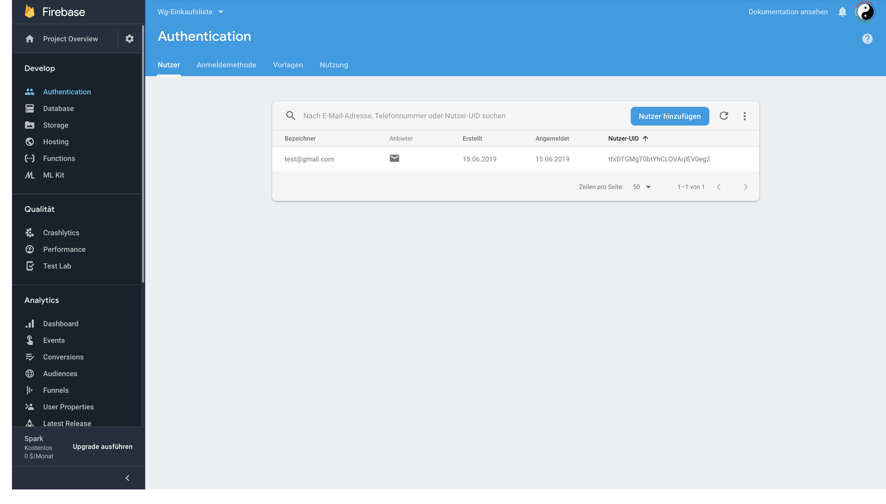

# Firebase Tutorial - Bauen einer WG Einkaufslisten iOS App

Die Ressourcen enthalten eine Starter und Final Version der App. Wir arbeiten in der Starter. Hier ist der meiste Code schon eingefügt und an den Stellen wo Code Snippets eingefügt werden soll ist das einerseits mit Warnings markiert andererseits sind in diesem PDF die Code Snippets.
Also öffnen wir die `WG-Shoppinglist.xcworkspace` Datei unter dem `WG-Shoppinglist-Starter` Ordner.

Das Starter  Projekt ist soweit fertig und kompilierbar bis auf die Firebase Funktionalität.

Wir arbeiten hauptsächlich auf den ViewControllern

* _LoginViewController.swift_:

    erhält die Logik für das Anmelden und Registrieren

* _GroceryListTableViewController.swift_:

    Ist der Hauptbildschirm. Hier werden Elemente hinzugefügt und angezeigt.

* _OnlineUsersTableViewController.swift_:

    Hier sieht man die online Benutzer der selben App.

---

## Erstellen eines Firebase Accounts und Projekt

Firebase ist ein Service von Google also sofern man einen Google Account hat
kann man Firebase ohne Probleme verwenden.
Um nun ein Projekt zu erstellen geht man auf [Link](https://firebase.google.com/)

### Projekt anlegen
Auf dieser Seite sieht man nun folgendes Bild


Durch Klicken auf den _Add project_ Button poppt dieser Screen auf


Nach ausfüllen sollte es ca. so aussehen


_Projekt erstellen_ Button klicken und das Projekt wird hoffentlich erfolgreich angelegt.

### Mit iOS verbinden

Nun da das Projekt erstellt ist erwartet uns folgender Screen


Hier ist ganz klar der _iOS_ Button zu sehen. Dies ist der Startpunkt um ein Projekt
mit einem Client zu verbinden. Wie zu sehen ist ist auch Android, Web und Unity verfügbar.


Hier einfach für iOS Bundle ID beispielsweise `at.{firstname-lastname}.wg-app` eingeben.
Die Bundle ID ist nur wichtig wenn die App im App Store veröffentlicht wird.

Nächster Schritt ist sehr wichtig, das Hinzufügen der GoogleService plist Datei in
das XCode Projekt

Dieser Schritt wird in dem Screen auch beschrieben.
Also erst die Datei runterladen und dann einfach in das XCode Projekt ziehen.


Es sollte nun so aussehen


In dem Starter Projekt sind die Pods (externen Bibliotheken) schon installiert und müssen daher nicht hinzugefügt werden.

Der letzte Punkt ist nun in `AppDelegate.swift` Firebase zu konfigurieren.
Dies geht über dieses Code Snippet.

``` swift
FirebaseApp.configure()
```

Um es zu finden kann man auch einfach die Warning anklicken.
 

 

Hat dies ohne Fehler funktioniert sollte alles passen.

## Items

### Erstellen einer Datenbank Referenz

#### Was sind Firebase Referenzen

Referenzen kann man sich wie einen Ordner oder Datei im Datensystem vorstellen.
Habe ich beispielsweise eine Referenz auf den "Ordner" _Shopping-Items_ kann ich über
diese Referenz "Dokumente" in diesen "Ordner" speichern, bearbeiten usw.
Jedes "Dokument" hat nun einen Inhalt in Form von Key-Value Pairs.

Dies wird alles verständlicher sobald wir es in der Firebase Webapp graphisch sehen.

### Items Referenz

Wir erstellen nun eine Datenbank Referenz die auf die Items in der Datenbank zeigt.
Da unser _GroceryListTableViewController_ die Items hinzufügt erstellen wir dort die Referenz.
Dieses Code Snippet unter Properties einfügen.

```
let ref = Database.database().reference(withPath: "grocery-items")
```

### Datenbank in der Web App initialisieren

Auf der Website unter dem Database Tab etwas runterscrollen und die Realtime Database auswählen.


Im nächsten Screen ist es wichtig die Datenbank im Testmodus zu erstellen.
Andernfalls muss man authentifiziert sein um sich verbinden zu können.


### (Optional) Nicht im Testmodus gestartet

Dieser Teil ist optional, und nur notwendig wenn du die Datenbank nicht im Testmodus gestartest hast.

In der erstellten Datenbank nun auf Regeln gehen und `read` und `write` auf `true` setzen.

Before:


After:


Als letzten Schritt noch auf _Veröffentlichen_ klicken

### Items speichern

Nun im _GroceryListTableViewController_ unter `addButtonDidTouch(_:)` folgendes Code Snippet einfügen

```
let saveAction = UIAlertAction(title: "Save",
                               style: .default) { _ in
    guard let textField = alert.textFields?.first,
      let text = textField.text else { return }

    let groceryItem = GroceryItem(name: text,
                           addedByUser: self.user.email,
                             completed: false)

    let groceryItemRef = self.ref.child(text.lowercased())

    groceryItemRef.setValue(groceryItem.toAnyObject())
}
```

In `addButtonDidTouch(_:)` wird das Popup aufgerufen und bei klicken auf den _Save_ Button wird der Code in der
`saveAction` ausgeführt.

In diesem Code Snippet wird einerseits der Inhalt des Textfeld ausgelesen und in der
Variable `text` gespeichert.

Danach wird ein `GroceryItem` angelegt mit dem Namen, der Email des eingeloggten Users und
dem `completed` Wert von `false`

Nun der spannende Teil ist das Speichern in Firebase was auf den letzten zwei Zeilen passiert.

`let groceryItemRef = self.ref.child(text.lowercased())` erzeugt eine Referenz auf das
Dokument des `text` im Ordner `ref`. Beispielweise Inhalt des Textfeldes ist _Milch_
dann setzt sich folgender Pfad zusammen -  `grocery-items/milch`

Nun wird an diesem Pfad über `setValue(groceryItem.toAnyObject())` die Daten des
vorhin erstellten `GroceryItem` gespeichert. `.toAnyObject()` ist nur eine Helper Methode
die das GroceryItem in ein Dictionary (JSON) verwandelt und returnt.

Mehr ist nicht notwendig um ein Item in Firebase zu speichern. Nun kann man es schon testen.
Es sollte folgendermaßen aussehen.

[comment]:

Wie man hier ebenfalls sehen kann, wird unsere TableView nicht geupdatet, dies beheben wir im nächsten Schritt.

### Items von Firebase in Realtime laden

Im _GroceryListTableViewController_ nun am Ende von `viewDidLoad()` dieses Code Snippet einfügen.

```
ref.observe(.value, with: { snapshot in
  print(snapshot.value as Any)
})
```

`observe(_:with:)` ist die Methode in Firebase um einerseits die Daten runterzuladen und
bei Updates am Server die neuen Daten zu erhalten. Dies passiert in Realtime - darum Realtime Database.

Das Code Snippet schaut sozusagen auf den "Ordner" `grocery-items` und lädt alle Dokumente
von diesem runter. Der Snapshot enthält diese dann und sieht so aus.
```
Optional({
    milch =     {
        addedByUser = "mc@hagenberg.at";
        completed = 0;
        name = Milch;
    };
})
```

Nun wollen wir die Items aber nicht in die Konsole printen sondern in die TableView bzw. unsere App laden.

Dafür das gerade hinzugefügte Code Snippet mit diesem ersetzen.

```
ref.observe(.value, with: { snapshot in
  var newItems: [GroceryItem] = []

  for child in snapshot.children {
    if let snapshot = child as? DataSnapshot,
       let groceryItem = GroceryItem(snapshot: snapshot) {
        newItems.append(groceryItem)
    }
  }

  self.items = newItems
  self.tableView.reloadData()
})
```

`observe` ist gleich wie vorher. Jedes Kind im Snapshot, also jedes Dokument wird nun
zu einem GroceryItem umgewandelt. Dies passiert mit dem Helper Initialisierer der einen
`DataSnapshot` nimmt. Alle Items werden dann in das `newItems` array gepusht,
welches dann `self.items` zugewiesen wird und über `self.tableView.reloadData()` wird
die TableView dann neu geladen um die runtergeladenen Items anzuzeigen.

Wenn man die App nun testet sieht man das die Items in der TableView angezeigt werden.
Man kann sich nun auch damit spielen die Daten eines Items auf der Firebase Website zu ändern
und dann beobachten wie es in der App geupdatet wird.

### Löschen der Items

Wir arbeiten immer noch in _GroceryTableViewController_. Nun werden wir die Delete Funktionalität
ändern um das Löschen vom Server und nicht nur lokal durchzuführen.

In der Methode `tableView(_:commit:forRowAt:)` den Code durch diesen ersetzen

```
if editingStyle == .delete {
  let groceryItem = items[indexPath.row]
  groceryItem.ref?.removeValue()
}
```

Das Löschen in Firebase ist sehr einfach, wir haben es sogar noch leichter gemacht, da wir
beim laden von Firebase die Referenz auf das Item speichern. Nun können wir diese verwenden
um mit `removeValue()` das Item-Dokument zu löschen. Die Referenz oder Pfad ist
beispielsweise `grocery-items/milch`.

### Checken von Items

Wir arbeiten immer noch in _GroceryTableViewController_.

Nun ändern wir den Code in der `tableView(_:didSelectRowAt:)`. Den Inhalt dieser Methode
mit folgendem Code ersetzen.

```
let groceryItem = items[indexPath.row]
let toggledCompletion = !groceryItem.completed
groceryItem.ref?.updateChildValues([
    "completed": toggledCompletion
    ])
tableView.reloadData()
```

Wir verwenden hier auch wieder die Referenz des Items um über die `updateChildValues()` Methode die Daten
zu updaten. `updateChildValues()` nimmt als Parameter ein Dictionary mit den key-value pairs.
Also in unserem Fall wollen wir "completed" zum neuen Completion Wert setzen.

## Users

Nun da alles zu den Items erledigt ist widmen wir uns dem Authentifizieren.

### In Firebase Webapp initialisieren

In der Webapp zu dem Authentication Tab wechseln um diesen Screen zu sehen.


Hier einfach den _Anmeldemethode einrichten_ Button klicken. Dann _E-Mail-Adresse/Passwort_ anklicken.
Dann nur den oberen Toggle Button aktivieren.


Und Speichern drücken.

### Registrierung

Nun arbeiten wir endlich in einem anderen ViewController - _LoginViewController_.

Hier ändern wir, wie oben schon die Action eines AlertController, dafür die Methode `signUpDidTouch(_:)` suchen.
Dann die leere `saveAction` suchen und folgenden Code einfügen.

```
let emailField = alert.textFields![0]
let passwordField = alert.textFields![1]

Auth.auth().createUser(withEmail: emailField.text!,
  password: passwordField.text!) { user, error in
  if error == nil {
    Auth.auth().signIn(withEmail: self.textFieldLoginEmail.text!,
                       password: self.textFieldLoginPassword.text!)
  }
}
```

In diesem Code passieren zwei Firebase Sachen. Einerseits wird über `Auth.auth().createUser(withEmail:password:)`
der Benutzer mit Email und Password registriert. Erhält man keinen Error von Firebase
wird der Benutzer auch noch eingeloggt mit `Auth.auth().signIn(withEmail:password:)`.

Testet man nun das Registrieren in der App passiert zwar noch nichts, doch auf Firebase
sieht man den Benutzer.




### Einloggen
Immer noch in _LoginViewController_ in der Methode `loginDidTouch(_:)` alten Code durch diesen ersetzen.

```
guard
  let email = textFieldLoginEmail.text,
  let password = textFieldLoginPassword.text,
  email.count > 0,
  password.count > 0
  else {
    return
}

Auth.auth().signIn(withEmail: email, password: password) { user, error in
  if let error = error, user == nil {
    let alert = UIAlertController(title: "Sign In Failed",
                                  message: error.localizedDescription,
                                  preferredStyle: .alert)

    alert.addAction(UIAlertAction(title: "OK", style: .default))

    self.present(alert, animated: true, completion: nil)
  }
}
```

Das `guard` statement ist nur da um sicherzustellen das Email und Password nicht leer sind.
`Auth.auth().signIn(withEmail:password:)` ist gleich wie oben, und ist die Methode zum anmelden in Firebase. Hier haben wir aber noch
Code in der Closure um dem User Feedback zu geben, wenn das Anmelden fehlschlägt.

Auch nach diesem Schritt kommt man nicht zum nächsten ViewController. Dies beheben wir im nächsten Schritt.

### Authenthication State

```
override func viewDidLoad() {
  super.viewDidLoad()

  Auth.auth().addStateDidChangeListener() { auth, user in
    if user != nil {
      self.performSegue(withIdentifier: self.loginToList, sender: nil)
      self.textFieldLoginEmail.text = nil
      self.textFieldLoginPassword.text = nil
    }
  }
}
```

Dieser Code erstellt einen Observer der triggert sobald sich der Authentifizierung Status ändert.
Ist der `user` nicht `nil` dann wird mit `self.performSegue(withIdentifier: self.loginToList, sender: nil)` der Übergang zum nächsten
ViewController durchgeführt.

Dieser Code wird auch ausgeführt wenn man in die App geht, also wenn man eingeloggt ist und die App schließt und wieder neu öffnet ist man sofort wieder eingeloggt.

### Items mit Benutzer Email anlegen

Nun zurück zum _GroceryListTableViewController_ um ein kleines Problem zu beheben. Zum erstellen von neuen Items wird nämlich noch
die Standard Email verwendet und nicht die des eingeloggten Benutzers.

Um dies zu ändern muss am Ende der `viewDidLoad()` Methode dieser Code eingefügt werden.

```
Auth.auth().addStateDidChangeListener { auth, user in
  guard let user = user else { return }
  self.user = User(authData: user)
  #warning("Code zum Speichern des Benutzer einfügen")
}
```

Hier wird wie schon vorher ein Observer auf den Authentifizierungs Status erstellt, der den User von Firebase zu einem User von unserer App ändert.

Mehr ist hierzu nicht notwendig.


### Ausloggen von Benutzern

Nun die Methode `signoutButtonPressed(_:)` im ViewController _OnlineUsersTableViewController_ suchen.
Und den alten Code mit diesem ersetzen.

```
let user = Auth.auth().currentUser!
let onlineRef = Database.database().reference(withPath: "online/\(user.uid)")

onlineRef.removeValue { (error, _) in
  if let error = error {
    print("Removing online failed: \(error)")
    return
  }

  do {
    try Auth.auth().signOut()
    self.dismiss(animated: true, completion: nil)
  } catch (let error) {
    print("Auth sign out failed: \(error)")
  }
}
```

Hier wird schon ein bisschen nach vorne gegriffen. Wir wollen später auch die eingeloggten Benutzer anzeigen, dafür speichern wir sie in die Datenbank
unter der `online` Referenz. Beim ausloggen müssen wir diese wieder entfernen.

Das eigentliche Ausloggen und zurückkehren zum LoginViewController ist nur dieser Teil
```
do {
    try Auth.auth().signOut()
    self.dismiss(animated: true, completion: nil)
  } catch (let error) {
    print("Auth sign out failed: \(error)")
  }
```

### Online Benutzer in die Datenbank speichern

Im _GroceryListTableViewController_ nun die vorher erwähnte online Referenz unter Properties einfügen.

`let usersRef = Database.database().reference(withPath: "online")`

Nun am Ende der `addStateDidChangeListener(_:)` Methode in `viewDidLoad()` den Code zum Speichern einfügen.

```
let currentUserRef = self.usersRef.child(self.user.uid)
currentUserRef.setValue(self.user.email)
currentUserRef.onDisconnectRemoveValue()
```

Dieser Code speichert die Email an die `online/uid` Referenz.

### Online Benutzer Anzahl updaten

Ebenfalls in der `viewDidLoad()` Methode am Ende den Code einfügen.

```
usersRef.observe(.value, with: { snapshot in
  if snapshot.exists() {
    self.userCountBarButtonItem?.title = snapshot.childrenCount.description
  } else {
    self.userCountBarButtonItem?.title = "0"
  }
})
```

Dieser Code lädt die Daten an der `online` Referenz runter und weißt die Anzahl der Kinder dem `userCountBarButtonItem` zu, welcher sich im rechten oberen Eck befindet.

### Online Benutzer Liste

Nun als letzen Punkt die Liste der online Benutzer. Hierfür müssen wir in den _OnlineUsersTableViewController_.

Als Erstes müssen wir eine Referenze an die `online` Position anlegen. Also wie vorhin folgenden Code an die Properties anfügen
`let usersRef = Database.database().reference(withPath: "online")`

Dann in `viewDidLoad()` den Code für den Fake Benutzer
`currentUsers.append("mc@hagenberg.at")`

mit folgendem ersetzen

```
usersRef.observe(.childAdded, with: { snap in
  guard let email = snap.value as? String else { return }
  self.currentUsers.append(email)
  self.tableView.reloadData()
})

usersRef.observe(.childRemoved, with: { snap in
  guard let emailToFind = snap.value as? String else { return }
  for (index, email) in self.currentUsers.enumerated() {
    if email == emailToFind {
      let indexPath = IndexPath(row: index, section: 0)
      self.currentUsers.remove(at: index)
      self.tableView.deleteRows(at: [indexPath], with: .fade)
    }
  }
})

```

Der erste Teil dieses Code lädt die Email von jedem Benutzer der unter der online Referenz gespeichert ist und ladet die TableView neu am die Änderungen anzuzeigen.

Der zweite Teil löscht die Email des Users aus der TableView sobald er offline oder abgemeldet ist.
